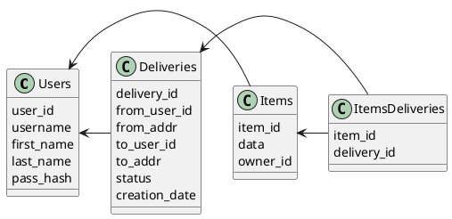

# Компонентная архитектура
<!-- Состав и взаимосвязи компонентов системы между собой и внешними системами с указанием протоколов, ключевые технологии, используемые для реализации компонентов.
Диаграмма контейнеров C4 и текстовое описание. 
-->
## Компонентная диаграмма

```plantuml
@startuml
!include https://raw.githubusercontent.com/plantuml-stdlib/C4-PlantUML/master/C4_Container.puml

AddElementTag("microService", $shape=EightSidedShape(), $bgColor="CornflowerBlue", $fontColor="white", $legendText="microservice")
AddElementTag("storage", $shape=RoundedBoxShape(), $bgColor="lightSkyBlue", $fontColor="white")

Person(user, "Пользователь")

System_Ext(web_site, "Клинтский веб-сайт", "HTML, CSS, JavaScript, Vue.js, Nginx")

System_Ext(logisics_system, "Система логистики")

System_Boundary(delivery_system, "Служба доставки") {
   Container(client_service, "Сервис пользователей", "go", "Сервис управления пользователями", $tags = "microService")    
   Container(item_service, "Сервис посылок", "go", "Сервис управления посылками", $tags = "microService") 
   Container(delivery_service, "Сервис доставок", "go", "Сервис управления доставками", $tags = "microService")
   ContainerDb(db, "База данных", "MariaDB", "хранилище данных", $tags = "storage")
}


Rel(user, web_site, "Регистрация, Просмотр/Создание/Получение посылок, Просмтр/Создание доставок")

Rel(web_site, client_service, "Работа с пользователями", "HTTP")
Rel(client_service, db, "INSERT/SELECT/UPDATE", "SQL")

Rel(web_site, item_service, "Работа с посылками", "HTTP")
Rel(item_service, client_service, "Аунтентификация пользователя", "HTTP")
Rel(item_service, db, "INSERT/SELECT/UPDATE", "SQL")

Rel(web_site, delivery_service, "Работа с доставками", "HTTP")
Rel(delivery_service, client_service, "Аунтентификация пользователя", "HTTP")
Rel(delivery_service, item_service, "Информация о поссылках", "HTTP")
Rel(delivery_service, db, "INSERT/SELECT/UPDATE", "SQL")

Rel(delivery_service, logisics_system, "Оповещения о новых заказах", "HTTP")
Rel(logisics_system, delivery_service, "Оповещения о изменении статуса доставки", "HTTP")

@enduml
```
## Список компонентов 

API приблизительный, он будет уточняться.

### Сервис пользователей
**API**:
- POST api/v1/auth/register
    - регистрация нового пользователя (запрос в сервис пользователей)
- GET/PATCH api/v1/usres/{user_id}
    - Получение информации о пользователе
    - Обновление информации о пользователе
- GET api/v1/search?mask="..." | api/v1/search?username="..."
  - Возвращает несколько возможных пользователей по логину либо по маске имени и фамилии

### Сервис посылок
**API**:
- POST api/v1/items
  - Создание посылки
- GET/PATCH apiv/v1/items/{item_id}
  - Получение информации о посылке
  - Обновление информации посылки
- GET api/v1/items_by_username/{username} 
  - Получение списка посылок пользователя

### Сервис доставок
**API**:
- POST api/v1/deliveries
  - Создание доставки от пользователя к пользователю
- GET api/v1/deliveries_from/{username}
  - Получение информации о доставке по получателю
- GET api/v1/deliveries_to/{username}
  - Получение информации о доставке по отрпавителю
- GET api/v1/deliveries?dt=...&id=...
  - Получение списка довых доставок для сервиса логистики
  - Возвращает первые n delivery_id в отсортированном порядке по id, которые имеют creation_date больше чем dt и delivery_id больше чем id.

### Модель данных
